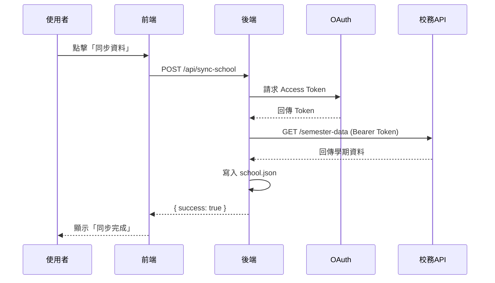
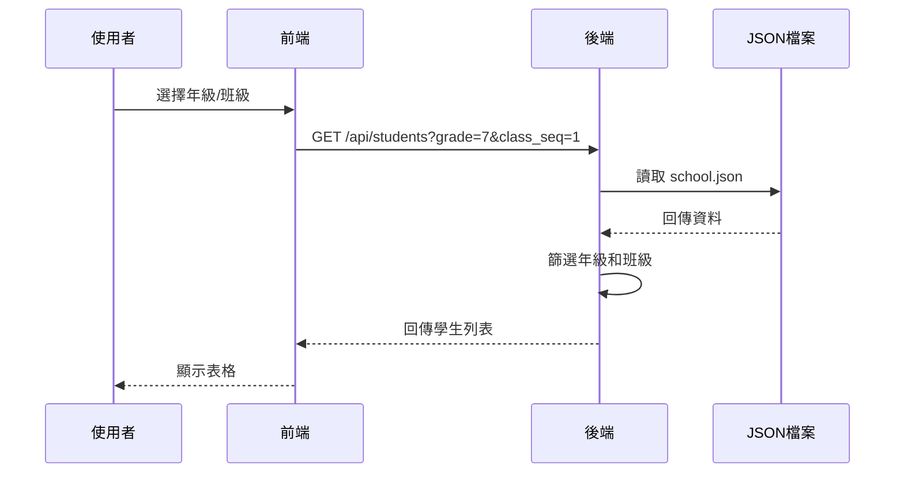

# 校務系統 API 整合專案教學文件

## 📋 目錄

1. [專案簡介](#專案簡介)
2. [系統架構](#系統架構)
3. [技術堆疊](#技術堆疊)
4. [環境需求](#環境需求)
5. [安裝與設定](#安裝與設定)
6. [Windows 開發環境建置](#windows-開發環境建置)
7. [後端開發指南](#後端開發指南)
8. [前端開發指南](#前端開發指南)
9. [API 文件](#api-文件)
10. [資料流程](#資料流程)
11. [開發注意事項](#開發注意事項)
12. [疑難排解](#疑難排解)

---

## 專案簡介

這是一個整合校務系統 API 的全端應用程式，主要功能包括：

- 📥 **資料同步**：從校務系統 API 同步學生、班級、教師資料
- 🔐 **OAuth 認證**：使用 Client Credentials 流程取得存取權杖
- 📊 **資料查詢**：提供年級、班級篩選功能查詢學生名單
- 🎨 **友善介面**：使用 Vue 3 + Element Plus 建構現代化 UI

### 使用情境

- 學校行政人員查詢學生名單
- 教師查看班級學生資料
- 定期同步校務系統最新資料

---

## 系統架構

```
┌─────────────┐         ┌─────────────┐         ┌─────────────┐
│   前端 Vue  │ ◄────► │  後端 API   │ ◄────► │ 校務系統 API │
│  (Port 5173)│         │ (Port 3001) │         │   (OAuth)    │
└─────────────┘         └─────────────┘         └─────────────┘
                               │
                               ▼
                        ┌─────────────┐
                        │ school.json │
                        │  (資料快取)  │
                        └─────────────┘
```

### 架構說明

1. **前端 (Frontend)**
   - Vue 3 單頁應用程式
   - 使用 Element Plus UI 框架
   - 透過 Axios 呼叫後端 API

2. **後端 (Backend)**
   - Express.js RESTful API 伺服器
   - OAuth 2.0 Client Credentials 認證
   - 將同步資料暫存於 JSON 檔案

3. **校務系統 API (External)**
   - 提供學生、班級、教師資料
   - 需要 OAuth 認證存取

---

## 技術堆疊

### 後端

| 技術 | 版本 | 用途 |
|------|------|------|
| Node.js | - | 執行環境 |
| Express | ^5.1.0 | Web 框架 |
| Axios | ^1.13.2 | HTTP 客戶端 |
| dotenv | ^17.2.3 | 環境變數管理 |
| cors | ^2.8.5 | 跨域資源共享 |
| qs | ^6.14.0 | 查詢字串序列化 |

### 前端

| 技術 | 版本 | 用途 |
|------|------|------|
| Vue | ^3.5.22 | 前端框架 |
| TypeScript | ~5.9.0 | 類型安全 |
| Vue Router | ^4.6.3 | 路由管理 |
| Pinia | ^3.0.3 | 狀態管理 |
| Element Plus | ^2.11.8 | UI 元件庫 |
| Vite | ^7.1.11 | 建置工具 |
| Axios | ^1.13.2 | HTTP 客戶端 |

---

## 環境需求

- **Node.js**: ^20.19.0 或 >=22.12.0
- **npm** 或 **yarn**
- **校務系統 API 憑證**：Client ID 和 Client Secret

---

## 安裝與設定

### 1. 複製專案

```bash
git clone <repository-url>
cd tc-api
```

### 2. 後端設定

#### 2.1 安裝依賴

```bash
npm install
```

#### 2.2 設定環境變數

在專案根目錄建立 `.env` 檔案：

```env
# 伺服器設定
PORT=3001

# OAuth 設定
OAUTH_TOKEN_URL=https://your-school-api.com/oauth/token
OAUTH_CLIENT_ID=your_client_id
OAUTH_CLIENT_SECRET=your_client_secret

# 校務系統 API 設定
SCHOOL_API_URL=https://your-school-api.com/api
```

#### 2.3 建立資料目錄

```bash
mkdir -p backend/data
```

### 3. 前端設定

```bash
cd frontend
npm install
```

### 4. 啟動應用程式

#### 啟動後端

```bash
# 在專案根目錄
node backend/app.js
```

後端將在 `http://localhost:3001` 啟動

#### 啟動前端

```bash
# 在 frontend 目錄
npm run dev
```

前端將在 `http://localhost:5173` 啟動

---

## Windows 開發環境建置

本章節專門針對 Windows 使用者提供完整的開發環境建置指南。

### 系統需求

- **作業系統**: Windows 10/11（建議使用 64 位元版本）
- **記憶體**: 至少 8GB RAM（建議 16GB）
- **硬碟空間**: 至少 5GB 可用空間

### 1. 安裝 Node.js

#### 1.1 下載 Node.js

1. 前往 [Node.js 官方網站](https://nodejs.org/)
2. 下載 **LTS（長期支援）版本**（建議 v20.x 或 v22.x）
3. 執行下載的 `.msi` 安裝程式

#### 1.2 安裝步驟

1. 執行安裝程式，點擊 **Next**
2. 接受授權條款
3. 選擇安裝路徑（建議使用預設路徑）
4. 確認勾選以下選項：
   - ✅ Node.js runtime
   - ✅ npm package manager
   - ✅ Add to PATH（**重要**）
5. 完成安裝

#### 1.3 驗證安裝

開啟 **命令提示字元（CMD）** 或 **PowerShell**，執行：

```powershell
node --version
npm --version
```

應該會顯示版本號，例如：
```
v20.19.0
10.9.2
```

### 2. 安裝 Git（選用但建議）

#### 2.1 下載 Git

1. 前往 [Git 官方網站](https://git-scm.com/download/win)
2. 下載最新版本的 Git for Windows
3. 執行安裝程式

#### 2.2 安裝設定

建議使用以下設定：
- 編輯器：選擇您偏好的編輯器（例如 VS Code）
- PATH 設定：選擇 **Git from the command line and also from 3rd-party software**
- HTTPS 傳輸：使用 **OpenSSL library**
- 行尾轉換：選擇 **Checkout Windows-style, commit Unix-style line endings**
- 終端機模擬器：選擇 **Use Windows' default console window** 或 **Use MinTTY**

#### 2.3 驗證安裝

```powershell
git --version
```

### 3. 安裝程式碼編輯器

#### 推薦：Visual Studio Code

1. 前往 [VS Code 官網](https://code.visualstudio.com/)
2. 下載 Windows 版本
3. 安裝時建議勾選：
   - ✅ 新增至 PATH（可在命令列中使用 `code` 指令）
   - ✅ 將「透過 Code 開啟」動作新增至檔案總管
   - ✅ 將「透過 Code 開啟」動作新增至目錄

#### 推薦擴充功能

安裝以下 VS Code 擴充功能以提升開發體驗：

- **Vue - Official**（Vue 3 支援）
- **ESLint**（程式碼檢查）
- **Prettier**（程式碼格式化）
- **Path Intellisense**（路徑自動完成）
- **Auto Close Tag**（自動關閉標籤）

### 4. 設定專案

#### 4.1 複製專案

使用 Git：
```powershell
git clone <repository-url>
cd tc-api
```

或直接下載專案 ZIP 檔並解壓縮。

#### 4.2 後端設定

##### 安裝後端依賴

在專案根目錄開啟 PowerShell 或命令提示字元：

```powershell
npm install
```

##### 建立環境變數檔案

在專案根目錄建立 `.env` 檔案：

**方法一：使用記事本**
```powershell
notepad .env
```

**方法二：使用 VS Code**
```powershell
code .env
```

輸入以下內容：
```env
# 伺服器設定
PORT=3001

# OAuth 設定
OAUTH_TOKEN_URL=https://your-school-api.com/oauth/token
OAUTH_CLIENT_ID=your_client_id
OAUTH_CLIENT_SECRET=your_client_secret

# 校務系統 API 設定
SCHOOL_API_URL=https://your-school-api.com/api
```

##### 建立資料目錄

```powershell
# PowerShell
New-Item -Path "backend\data" -ItemType Directory -Force

# 或使用 CMD
mkdir backend\data
```

#### 4.3 前端設定

##### 安裝前端依賴

```powershell
cd frontend
npm install
```

> **注意**：如果遇到 `EPERM` 或權限錯誤，請以**系統管理員身分**執行 PowerShell 或 CMD。

### 5. 啟動開發伺服器

#### 5.1 啟動後端

**方法一：使用 PowerShell（建議開啟兩個終端視窗）**

在專案根目錄：
```powershell
node backend\app.js
```

**方法二：使用 VS Code 整合終端機**

1. 在 VS Code 中開啟專案
2. 按 `` Ctrl + ` `` 開啟終端機
3. 執行：
   ```powershell
   node backend\app.js
   ```

成功啟動後會顯示：
```
Backend running on http://localhost:3001
```

#### 5.2 啟動前端

開啟**另一個**終端視窗，切換到 frontend 目錄：

```powershell
cd frontend
npm run dev
```

成功啟動後會顯示類似：
```
VITE v7.1.11  ready in 1234 ms

➜  Local:   http://localhost:5173/
➜  Network: use --host to expose
➜  press h + enter to show help
```

#### 5.3 在瀏覽器中開啟

開啟瀏覽器，前往：
- 前端：`http://localhost:5173`
- 後端 API：`http://localhost:3001/api`

### 6. Windows 特定注意事項

#### 6.1 路徑分隔符號

Windows 使用反斜線 `\`，而 Linux/Mac 使用斜線 `/`。Node.js 的 `path` 模組會自動處理，但在設定檔中請注意：

```javascript
// ✅ 推薦：使用 path.join()
const filePath = path.join(__dirname, 'data', 'school.json');

// ❌ 避免：硬編碼路徑
const filePath = __dirname + '/data/school.json';  // 在 Windows 可能有問題
```

#### 6.2 防火牆設定

第一次啟動後端時，Windows 防火牆可能會跳出提示：

1. 點擊「**允許存取**」
2. 確保勾選「**私人網路**」

#### 6.3 埠號佔用問題

如果遇到 `EADDRINUSE` 錯誤（埠號已被佔用）：

**查詢佔用埠號的程序：**
```powershell
netstat -ano | findstr :3001
```

**結束該程序：**
```powershell
taskkill /PID <PID號碼> /F
```

#### 6.4 Node.js 版本管理

如需管理多個 Node.js 版本，建議使用 **nvm-windows**：

1. 前往 [nvm-windows Releases](https://github.com/coreybutler/nvm-windows/releases)
2. 下載 `nvm-setup.exe`
3. 安裝後使用：
   ```powershell
   nvm install 20.19.0
   nvm use 20.19.0
   ```

#### 6.5 編碼問題

如果在終端機中看到亂碼，執行：

```powershell
# PowerShell
[Console]::OutputEncoding = [System.Text.Encoding]::UTF8

# 或設定 Node.js 環境變數
$env:NODE_OPTIONS="--max-old-space-size=4096"
```

### 7. 使用 PowerShell 腳本自動化

#### 7.1 建立啟動腳本

在專案根目錄建立 `start.ps1`：

```powershell
# start.ps1
Write-Host "🚀 啟動校務系統 API 專案..." -ForegroundColor Green

# 檢查 Node.js
if (!(Get-Command node -ErrorAction SilentlyContinue)) {
    Write-Host "❌ 未安裝 Node.js，請先安裝 Node.js" -ForegroundColor Red
    exit 1
}

# 檢查依賴
if (!(Test-Path "node_modules")) {
    Write-Host "📦 安裝後端依賴..." -ForegroundColor Yellow
    npm install
}

if (!(Test-Path "frontend\node_modules")) {
    Write-Host "📦 安裝前端依賴..." -ForegroundColor Yellow
    Set-Location frontend
    npm install
    Set-Location ..
}

# 檢查環境變數
if (!(Test-Path ".env")) {
    Write-Host "⚠️  未找到 .env 檔案，請先設定環境變數" -ForegroundColor Yellow
}

# 啟動後端
Write-Host "🔧 啟動後端伺服器..." -ForegroundColor Cyan
Start-Process powershell -ArgumentList "-NoExit", "-Command", "node backend\app.js"

# 等待後端啟動
Start-Sleep -Seconds 3

# 啟動前端
Write-Host "🎨 啟動前端伺服器..." -ForegroundColor Cyan
Start-Process powershell -ArgumentList "-NoExit", "-Command", "cd frontend; npm run dev"

Write-Host "✅ 專案啟動完成！" -ForegroundColor Green
Write-Host "前端: http://localhost:5173" -ForegroundColor Magenta
Write-Host "後端: http://localhost:3001" -ForegroundColor Magenta
```

#### 7.2 執行腳本

```powershell
# 如果遇到執行原則問題，先執行：
Set-ExecutionPolicy -Scope CurrentUser -ExecutionPolicy RemoteSigned

# 執行啟動腳本
.\start.ps1
```

### 8. 疑難排解（Windows 專屬）

#### 問題 1: npm install 失敗

**錯誤訊息：** `EPERM: operation not permitted` 或 `EACCES`

**解決方法：**
1. 以**系統管理員身分**執行 PowerShell
2. 清除 npm 快取：
   ```powershell
   npm cache clean --force
   ```
3. 重新安裝：
   ```powershell
   npm install
   ```

#### 問題 2: node-gyp 編譯錯誤

**錯誤訊息：** `gyp ERR! find VS`

**解決方法：**
安裝 Windows Build Tools：
```powershell
npm install --global windows-build-tools
```

#### 問題 3: 路徑過長錯誤

**錯誤訊息：** `ENAMETOOLONG`

**解決方法：**
啟用 Windows 長路徑支援：

1. 以系統管理員身分執行 PowerShell
2. 執行：
   ```powershell
   New-ItemProperty -Path "HKLM:\SYSTEM\CurrentControlSet\Control\FileSystem" -Name "LongPathsEnabled" -Value 1 -PropertyType DWORD -Force
   ```
3. 重新啟動電腦

#### 問題 4: 無法載入 .env 檔案

**錯誤訊息：** 環境變數未定義

**檢查項目：**
- `.env` 檔案是否在專案根目錄
- 檔案編碼是否為 UTF-8（不要使用 UTF-8 with BOM）
- 是否有安裝 `dotenv` 套件

#### 問題 5: PowerShell 腳本無法執行

**錯誤訊息：** `無法載入，因為這個系統上已停用指令碼執行`

**解決方法：**
```powershell
Set-ExecutionPolicy -Scope CurrentUser -ExecutionPolicy RemoteSigned
```

### 9. 開發工具建議

#### 9.1 終端機工具

**Windows Terminal**（強烈推薦）

- 從 Microsoft Store 下載
- 支援多分頁、自訂主題
- 整合 PowerShell、CMD、Git Bash

#### 9.2 API 測試工具

- **Postman**：圖形化 API 測試工具
- **Thunder Client**：VS Code 擴充功能
- **curl**（PowerShell 內建）：
  ```powershell
  curl http://localhost:3001/api/students
  ```

#### 9.3 資料庫檢視工具

如果未來整合資料庫，推薦：
- **DBeaver**：通用資料庫工具
- **DB Browser for SQLite**：SQLite 專用

### 10. 效能優化（Windows）

#### 10.1 排除防毒軟體掃描

將專案目錄加入防毒軟體的排除清單，避免影響 `npm install` 和開發伺服器效能：

- **Windows Defender**：
  1. 設定 → 更新與安全性 → Windows 安全性
  2. 病毒與威脅防護 → 管理設定
  3. 新增排除項目 → 資料夾
  4. 選擇專案目錄

#### 10.2 使用 SSD

確保專案位於 SSD 上，而非 HDD，可大幅提升 `npm install` 和建置速度。

#### 10.3 增加 Node.js 記憶體限制

如果專案較大，可增加 Node.js 記憶體：

```powershell
$env:NODE_OPTIONS="--max-old-space-size=4096"
```

---

## 後端開發指南

### 專案結構

```
backend/
├── app.js                 # Express 應用程式進入點
├── config.js              # 設定檔管理
├── import-school.js       # 資料匯入腳本
├── data/
│   └── school.json        # 同步後的資料快取
├── routes/
│   ├── students.js        # 學生路由
│   ├── classes.js         # 班級路由
│   ├── teachers.js        # 教師路由
│   └── sync.js            # 資料同步路由
└── services/
    ├── oauthClient.js     # OAuth 認證服務
    ├── schoolApi.js       # 校務 API 呼叫服務
    └── importSchool.js    # 資料匯入服務
```

### 核心模組說明

#### 1. OAuth 認證服務 (`services/oauthClient.js`)

```javascript
// 取得存取權杖（具快取機制）
async function getAccessToken() {
  // 檢查快取是否有效
  const now = Date.now();
  if (cachedToken && now < expire) {
    return cachedToken;
  }

  // 使用 Client Credentials 流程取得新權杖
  const resp = await axios.post(config.oauth.token_url, data, {
    headers: { "Content-Type": "application/x-www-form-urlencoded" }
  });

  // 快取權杖並設定過期時間
  cachedToken = resp.data.access_token;
  expire = now + resp.data.expires_in * 1000 - 5000;

  return cachedToken;
}
```

**重點特色：**
- ✅ 自動快取 Access Token
- ✅ 避免重複請求
- ✅ 自動續期管理

#### 2. 校務 API 服務 (`services/schoolApi.js`)

```javascript
async function getSchoolSemesterData() {
    const token = await getAccessToken();

    const resp = await axios.get(`${config.school.api_url}/semester-data`, {
        headers: {
            Authorization: `Bearer ${token}`
        }
    });

    return resp.data;
}
```

**功能：**
- 自動附加 OAuth Bearer Token
- 取得學期資料（包含學生、班級等）

#### 3. 資料同步路由 (`routes/sync.js`)

```javascript
router.post("/", async (req, res) => {
  try {
    // 從校務 API 取得資料
    const data = await getSchoolSemesterData();

    // 儲存至本地 JSON 檔案
    const outputPath = path.join(__dirname, "../data/school.json");
    fs.writeFileSync(outputPath, JSON.stringify(data, null, 2), "utf8");

    res.json({ success: true, message: "同步完成" });
  } catch (err) {
    res.status(500).json({
      success: false,
      message: "同步失敗",
      error: err.message
    });
  }
});
```

**流程：**
1. 呼叫校務 API
2. 將資料寫入 `school.json`
3. 回傳同步結果

#### 4. 學生查詢路由 (`routes/students.js`)

```javascript
router.get("/", (req, res) => {
  // 讀取 school.json
  const data = JSON.parse(fs.readFileSync(filePath, "utf8"));
  const { grade, class_seq } = req.query;

  // 篩選年級和班序
  let filtered = data["學期編班"];
  if (grade) {
    filtered = filtered.filter(c => c["年級"] == grade);
  }
  if (class_seq) {
    filtered = filtered.filter(c => c["班序"] == class_seq);
  }

  // 組合學生資料
  const result = [];
  for (const klass of filtered) {
    for (const stu of klass["學期編班"] || []) {
      result.push({
        student_no: stu["學號"],
        name: stu["姓名"],
        gender: stu["性別"],
        grade: klass["年級"],
        class_name: klass["班名"],
        class_seq: klass["班序"],
        seat_no: stu["座號"]
      });
    }
  }

  res.json(result);
});
```

**查詢參數：**
- `grade`: 年級篩選（選填）
- `class_seq`: 班序篩選（選填）

---

## 前端開發指南

### 專案結構

```
frontend/src/
├── main.ts                # 應用程式進入點
├── App.vue                # 根元件
├── api/
│   └── students.js        # API 呼叫模組
├── assets/                # 靜態資源
├── components/            # 可重用元件
├── layouts/
│   └── SidebarMenu.vue    # 側邊選單佈局
├── router/
│   └── index.ts           # 路由設定
├── stores/                # Pinia 狀態管理
└── views/
    ├── StudentList.vue    # 學生列表頁面
    └── TeacherList.vue    # 教師列表頁面
```

### 核心元件說明

#### 1. 主應用程式 (`main.ts`)

```typescript
import { createApp } from 'vue'
import { createPinia } from 'pinia'
import App from './App.vue'
import router from './router'
import ElementPlus from "element-plus"
import "element-plus/dist/index.css"

const app = createApp(App)

app.use(createPinia())      // 狀態管理
app.use(router)             // 路由
app.use(ElementPlus)        // UI 元件庫
app.mount('#app')
```

#### 2. 路由設定 (`router/index.ts`)

```typescript
const routes = [
  { path: "/", component: StudentList },
  { path: "/students", component: () => import("../views/StudentList.vue") },
  { path: "/teachers", component: () => import("../views/TeacherList.vue") }
];

export default createRouter({
  history: createWebHistory(),
  routes
});
```

**特色：**
- 使用 History 模式（無 # 符號）
- 支援動態載入（Code Splitting）

#### 3. 學生列表元件 (`views/StudentList.vue`)

**核心功能：**

##### 資料同步

```javascript
async function syncData() {
  syncing.value = true;
  try {
    await axios.post(`${apiBase}/sync-school`);
    await loadClasses();
    selectedGrade.value = null;
    selectedClass.value = null;
    students.value = [];
    ElMessage.success("同步完成！");
  } catch (e) {
    ElMessage.error("同步失敗");
  } finally {
    syncing.value = false;
  }
}
```

##### 年級班級聯動

```javascript
function onGradeChange() {
  selectedClass.value = null;      // 清空班級選擇
  students.value = [];              // 清空學生列表
  classList.value = selectedGrade.value 
    ? classMap.value[selectedGrade.value] 
    : [];
}
```

##### 學生資料載入

```javascript
async function loadStudents() {
  if (!selectedGrade.value || !selectedClass.value) return;
  const resp = await axios.get(
    `${apiBase}/students?grade=${selectedGrade.value}&class_seq=${selectedClass.value}`
  );
  students.value = resp.data;
}
```

**UI 特色：**
- 使用 Element Plus 的 Card、Select、Table、Button 元件
- 響應式佈局設計
- Loading 狀態提示
- 成功/失敗訊息提示

---

## API 文件

### Base URL

```
http://localhost:3001/api
```

### 1. 同步資料

**端點：** `POST /sync-school`

**描述：** 從校務系統 API 同步最新資料至本地

**回應：**

```json
{
  "success": true,
  "message": "同步完成"
}
```

**錯誤回應：**

```json
{
  "success": false,
  "message": "同步失敗",
  "error": "錯誤訊息"
}
```

### 2. 查詢學生

**端點：** `GET /students`

**描述：** 取得學生列表，支援年級和班級篩選

**查詢參數：**

| 參數 | 類型 | 必填 | 說明 |
|------|------|------|------|
| grade | number | 否 | 年級 (1-9) |
| class_seq | number | 否 | 班序 |

**範例請求：**

```
GET /students?grade=7&class_seq=1
```

**回應：**

```json
[
  {
    "student_no": "20230001",
    "name": "王小明",
    "gender": "男",
    "grade": 7,
    "class_name": "701",
    "class_seq": 1,
    "seat_no": 1
  },
  {
    "student_no": "20230002",
    "name": "李小華",
    "gender": "女",
    "grade": 7,
    "class_name": "701",
    "class_seq": 1,
    "seat_no": 2
  }
]
```

### 3. 查詢班級

**端點：** `GET /classes`

**描述：** 取得所有年級和班級資訊

**回應：**

```json
{
  "grades": [7, 8, 9],
  "classes": {
    "7": [
      { "年級": 7, "班名": "701", "班序": 1 },
      { "年級": 7, "班名": "702", "班序": 2 }
    ],
    "8": [
      { "年級": 8, "班名": "801", "班序": 1 }
    ]
  }
}
```

### 4. 查詢教師

**端點：** `GET /teachers`

**描述：** 取得教師列表

**回應：** *(依實際 API 格式)*

---

## 資料流程

### 同步流程



### 查詢流程



---

## 開發注意事項

### 安全性

1. **環境變數保護**
   - ⚠️ **絕對不要**將 `.env` 檔案提交至 Git
   - 建議在 `.gitignore` 中加入：
     ```
     .env
     backend/data/school.json
     ```

2. **API 金鑰管理**
   - Client Secret 應僅存於伺服器端
   - 定期更換 OAuth 憑證

3. **CORS 設定**
   - 生產環境應限制允許的來源：
     ```javascript
     app.use(cors({
       origin: 'https://your-domain.com'
     }));
     ```

### 效能優化

1. **Token 快取**
   - OAuth Token 已實作快取機制
   - 避免每次請求都重新取得 Token

2. **資料快取**
   - 使用 `school.json` 快取資料
   - 減少對校務 API 的直接請求

3. **前端優化**
   - 使用路由懶載入（Lazy Loading）
   - 避免不必要的重新渲染

### 錯誤處理

1. **後端錯誤處理**
   ```javascript
   try {
     // API 呼叫
   } catch (err) {
     console.error("[ERROR]", err);
     res.status(500).json({
       success: false,
       message: "操作失敗",
       error: err.message
     });
   }
   ```

2. **前端錯誤處理**
   ```javascript
   try {
     await axios.post(url);
     ElMessage.success("操作成功");
   } catch (e) {
     ElMessage.error("操作失敗");
     console.error(e);
   }
   ```

### 資料格式假設

- 校務 API 回傳資料應包含 `學期編班` 陣列
- 每個班級物件應包含：`年級`、`班名`、`班序`、`學期編班`
- 每個學生物件應包含：`學號`、`姓名`、`性別`、`座號`

---

## 疑難排解

### 常見問題

#### 1. 後端無法啟動

**問題：** `Error: Cannot find module 'dotenv'`

**解決方法：**
```bash
npm install
```

#### 2. OAuth 認證失敗

**問題：** `401 Unauthorized`

**檢查項目：**
- ✅ `.env` 檔案中的 `OAUTH_CLIENT_ID` 和 `OAUTH_CLIENT_SECRET` 是否正確
- ✅ `OAUTH_TOKEN_URL` 端點是否正確
- ✅ 網路是否可連線至校務 API

#### 3. 前端無法連線後端

**問題：** `Network Error` 或 `CORS Error`

**解決方法：**
- 確認後端已啟動在 `http://localhost:3001`
- 檢查前端 API Base URL 設定
- 確認後端已啟用 CORS

#### 4. 同步後沒有資料

**問題：** 查詢學生時回傳空陣列

**檢查項目：**
- ✅ `backend/data/school.json` 檔案是否存在
- ✅ JSON 檔案格式是否正確
- ✅ 校務 API 是否有回傳資料

#### 5. 前端選單無法選擇

**問題：** 班級下拉選單始終禁用

**解決方法：**
- 先選擇年級
- 確認 `/api/classes` 有正確回傳資料
- 檢查 `classList.value` 是否有值

### 除錯技巧

#### 後端除錯

1. **查看 Console 輸出**
   ```bash
   node backend/app.js
   ```

2. **檢查 JSON 檔案**
   ```bash
   cat backend/data/school.json | jq
   ```

3. **測試 API 端點**
   ```bash
   # 同步資料
   curl -X POST http://localhost:3001/api/sync-school

   # 查詢學生
   curl http://localhost:3001/api/students?grade=7&class_seq=1
   ```

#### 前端除錯

1. **開啟瀏覽器開發者工具**
   - Network 標籤：查看 API 請求
   - Console 標籤：查看錯誤訊息

2. **Vue DevTools**
   - 安裝 Vue DevTools 擴充功能
   - 檢查元件狀態和資料流

---

## 進階擴充

### 建議功能

1. **資料庫整合**
   - 使用 SQLite 或 PostgreSQL 取代 JSON 檔案
   - 提升查詢效能和資料安全性

2. **使用者認證**
   - 新增登入功能
   - 實作權限管理（學生/教師/行政人員）

3. **即時更新**
   - 使用 WebSocket 或 Server-Sent Events
   - 資料同步時自動更新前端畫面

4. **匯出功能**
   - 匯出學生名單為 Excel 或 PDF
   - 列印功能

5. **搜尋功能**
   - 依姓名、學號搜尋學生
   - 模糊搜尋

6. **排序功能**
   - 依座號、姓名、學號排序
   - 多欄位排序

### 部署建議

#### 開發環境

```bash
# 後端
node backend/app.js

# 前端
cd frontend && npm run dev
```

#### 生產環境

1. **建置前端**
   ```bash
   cd frontend
   npm run build
   ```

2. **設定 Nginx**
   ```nginx
   server {
       listen 80;
       server_name your-domain.com;

       # 前端靜態檔案
       location / {
           root /path/to/frontend/dist;
           try_files $uri $uri/ /index.html;
       }

       # 後端 API
       location /api {
           proxy_pass http://localhost:3001;
           proxy_http_version 1.1;
           proxy_set_header Upgrade $http_upgrade;
           proxy_set_header Connection 'upgrade';
           proxy_set_header Host $host;
           proxy_cache_bypass $http_upgrade;
       }
   }
   ```

3. **使用 PM2 管理後端**
   ```bash
   npm install -g pm2
   pm2 start backend/app.js --name tc-api
   pm2 save
   pm2 startup
   ```

---

## 授權與貢獻

### 授權

本專案僅供教學使用。

### 貢獻指南

1. Fork 此專案
2. 建立功能分支 (`git checkout -b feature/AmazingFeature`)
3. 提交變更 (`git commit -m 'Add some AmazingFeature'`)
4. 推送至分支 (`git push origin feature/AmazingFeature`)
5. 開啟 Pull Request

---

## 聯絡資訊

如有任何問題或建議，歡迎聯絡：

- 📧 Email: hami@cloudedu.com.tw
- 💬 Issue: [GitHub Issues](https://github.com/your-repo/issues)

---

## 更新日誌

### v1.0.0 (2025-11-26)

- ✅ 初始版本發布
- ✅ 基本資料同步功能
- ✅ 學生查詢功能
- ✅ Vue 3 前端介面
- ✅ OAuth 2.0 認證

---

**最後更新：** 2025 年 11 月 26 日
